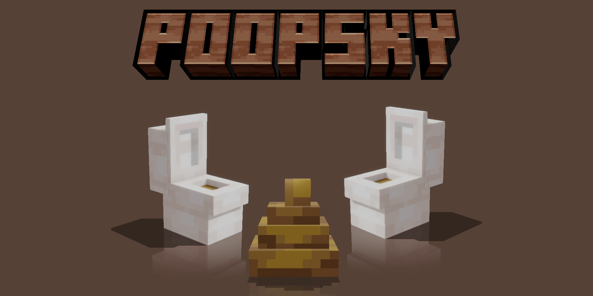



A Minecraft mod that introduces many new Poop and items.

# PoopSky

## Build

1. Use [IntelliJ IDEA](https://www.jetbrains.com/idea/) & [JDK 25](https://adoptium.net/temurin/releases/?os=any&version=25)
2. Run `gradlew runData`
3. Run `gradlew runClient`

## Download

- [Modrinth](https://modrinth.com/mod/poopsky)
- [Curseforge](https://www.curseforge.com/minecraft/mc-mods/poopsky)

## LICENSE

- [CODE](LICENSE-CODE)
- [ART](LICENSE-ART)

## Credits

- [Create](https://github.com/Creators-of-Create/Create/)
- [Just Enough Items](https://github.com/mezz/JustEnoughItems)
- [Registrate](https://github.com/tterrag1098/Registrate)
